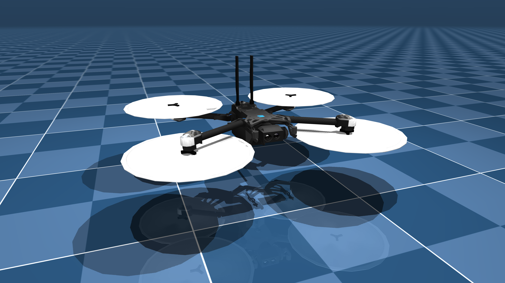

# Edits

### 17.01.2026 
- Turned off the gate movement in "flight" mode
- Reduced the speed of the gates
- Fixed issues with opening and closing renderer
- Modified `pyproject.toml` to exclude python 3.14+

# Problem Description

In this homework, you will work with the same environment as the previous assignment.
Unique aruco tags have been added to each of the gates.
The gates are now moving in random directions.

## Sensors

For most of the task the only input allowed is the drone’s front camera image
(`camera_frame` generated in each simulation step).

## Tasks

1. Detect the gate on `camera_frame`.
Using known structure of the gate, estimate the drone’s position.
You may use `scene.xml` and `x2.xml` to learn the object structure.
Gate geometry remains fixed, but their positions and rotations are randomized in each simulation.
You are not required to successfully detect markers in each simulation step.
2. Estimating the pose from an image results in measurement errors.
Such fluctuations are undesirable from navigation perspective.
Implement a Kalman filter to smoothen the estimates:
- Create a separate file `kalman_filter.py` with your implementation of a Kalman filter. 
- Import and use it in `drone_control.py`.
3. Include a short report that contains:
- a brief description of a model used in your Kalman filter as well as how you are choosing measurement and process noise covariances
- a plot/plots comparing raw estimates, Kalman filtered estimates and ground truth for each dimension generated with `plot_results` function
- one insight from this project that you have found particularly interesting/challenging
4. Navigate the drone through the gates using a PID controller without relying on artificial position and orientation measurements from the `DroneSimulator` class.
This task might be is significantly hard.
Hence, we allow adding additional sensors to the scene,
but they have to make real life sense.
A good examples are an accelerometer or a gyroscope.
This is something one could have on a real drone, and so is acceptable.
MuJoCo already supports the two above sensors.
You can change the scene and assume that the gates are not moving when solving this task.
Also, it's absolutely enough to solve only the version with no wind gusts.

## Requirements

See `pyproject.toml` and `uv.lock`.

# Submission format

**You should submit via moodle before the deadline.**

Before submitting, go through the list below and make sure you took care of all of the requirements.
More details can be found in the detailed task description.
**If you do not comply with these regulations you can be penalized up to obtaining zero points for the task.**.

1. Submit a zipped file named with your student number with at least the three following files inside:
- `drone_control.py`
- `kalman_filter.py`
- `report.pdf`
2. The simulation should not crash at any stage.

## Grading

Total: 18
- 4 for an aruco tag detection and relative position estimation
- 6 for an implementation and use of the Kalman filter
- 5 for a report
- 3 for a successful flight through the gates using PID controllers

## Assets (for more details see Homework 2)

### Skydio X2

We use a simplified robot description (MJCF) of the [Skydio X2](https://www.skydio.com/skydio-x2) drone developed by [Skydio](https://www.skydio.com/).
The model and necessary assets were downloaded from [mujoco_menagerie](https://github.com/google-deepmind/mujoco_menagerie).
Rotor gears were slightly changed to allow yaw control.

{: width="200" }

# References and Licenses

The [Skydio X2](https://www.skydio.com/skydio-x2) model is released under an [Apache-2.0 License](LICENSE). Compared to the original model, only one camera has been changed and a second one has been added.
